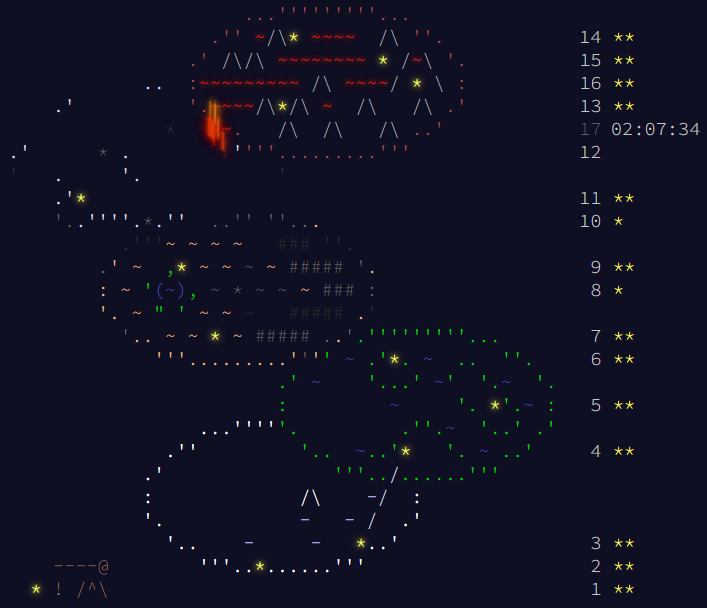

# Completion

|Day|Title|Part 1 File|Part 1 Time|Part 1 Difficulty|Part 2 File|Part 2 Time|Part 2 Difficulty *(note 1)*|
|:-:|:-:|:-:|:-:|:-:|:-:|:-:|:-:|
|1|[Trebuchet?!](https://adventofcode.com/2023/day/1)|[01-1.js](01-1.js#L1002)|1.154ms|1.5|[01-2.js](01-2.js#L1002)|17.189ms|2.5|
|2|[Cube Conundrum](https://adventofcode.com/2023/day/2)|[02-1.js](02-1.js#L102)|0.816ms|1|[02-2.js](02-2.js#L102)|3.770ms|1|
|3|[Gear Ratios](https://adventofcode.com/2023/day/3/)|[03-1.js](03-1.js#L142)|2.245ms|2 *(note 2)*|[03-2.js](03-2.js#L142)|2.500ms|1.5|
|4|[Scratchcards](https://adventofcode.com/2023/day/4)|[04-1.js](04-1.js#L218)|1.599ms|1|[04-2.js](04-2.js#L218)|1.725ms|1|
|5|[If You Give A Seed A Fertilizer](https://adventofcode.com/2023/day/5)|[05-1.js](05-1.js#L211)|0.907ms|1.5|[05-2.js](05-2.js#L211)|2.283ms|*3*|
|6|[Wait For It](https://adventofcode.com/2023/day/6)|[06-1.js](06-1.js#L4)|0.052ms|1.5 *(note 3)*|[06-2.js](06-2.js#L4)|0.016ms|1|
|7|[Camel Cards](https://adventofcode.com/2023/day/7)|[07-1.js](07-1.js#L1002)|3.688ms|2|[07-2.js](07-2.js#L1002)|4.005ms|**3.5** *(note 4)*|
|8|[Haunted Wasteland](https://adventofcode.com/2023/day/8)|[08-1.js](08-1.js#L730)|2.304ms|1|-|-|***4***|
|9|[Mirage Maintenance](https://adventofcode.com/2023/day/9)|[09-1.js](09-1.js#L202)|2.004ms|1|[09-2.js](09-2.js#L202)|2.299ms|1|
|10|[Pipe Maze](https://adventofcode.com/2023/day/10)|[10-1.js](10-1.js#L176)|34.580ms|2|-|-|***4***|
|11|[Cosmic Expansion](https://adventofcode.com/2023/day/11)|[11-1.js](11-1.js#L142)|2.334ms|1.5|[11-2.js](11-2.js#L142)|2.901ms|1|
|12|[Hot Springs](https://adventofcode.com/2023/day/12)|-|-|4|-|-|-|
|13|[Point of Incidence](https://adventofcode.com/2023/day/13)|[13-1.js](13-1.js#L1379)|2.007ms|1.5|[13-2.js](13-2.js#L1379)|1.742ms|1.5|
|14|[Parabolic Reflector Dish](https://adventofcode.com/2023/day/14)|[14-1.js](14-1.js#L102)|1.316ms|1.5|[14-2.js](14-2.js#L102)|378.575ms|*3*|
|15|[Lens Library](https://adventofcode.com/2023/day/15)|[15-1.js](15-1.js#L3)|0.420ms|1|[15-2.js](15-2.js#L3)|2.533ms|1|

# Difficulty
1: easy peasy

1.5: thought about it a little bit

2: getting harder

2.5: maybe not that easy

*3*: alternative solution required

**3.5**: this makes me f\*cking exhausted

***4***: not solved / solved after watching solution

# Notes
1. After getting the first part correct. Take Day 3 for example, if you got first part correct (i.e. you parsed the input correctly), the second part is not that hard
2. Debugging this one is just pain because the "edge case" is not included in example input
3. If you know some math, else it will be 3 for one of two parts today
4. Reasons below:
  - There are too many special cases that I can't know from any way
  - I have no idea why my latest algorithm, compared to other methods, is the only working algorithm
  - There's no way to know where my code went wrong: 1000 inputs, weird output formula that doesn't even take calculation results as parameter